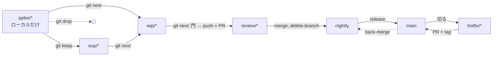

# 02. ブランチの段 — 段 = prefix、slug は不変

> **Status**: Draft
> **Related**: `mem_1CfZvzMGQyyyQJLqyZMyR8`（Conception と裁定の原文）、`mem_1CfZz3aDDKfmVm7uRs6w9Z`（Mermaid 図 5 枚）、`mem_1Cfa1hzGjo7uen8XuchVQg`（起票）
> **対象**: `skills/branch-step/`, `skills/chronista-style/SKILL.md`（ブランチ運用）, `skills/parallel-dev/SKILL.md`, `skills/codeflow/SKILL.md`, `tests/test_branch_step.py`

## Abstract

ブランチ名は「今どの段にいるか」だけを語る。一つの仕事に一つの slug（起票 memory と同じ、不変）、prefix が段。段が進んだら `git branch -m` で rename する。段ごとに語り手は一人 — PR 以前は枝、PR 以後は PR、merge 以後は trunk と tag。起点は全列 nightly なので名前に載せず、名前に載せるのは例外（hotfix）だけ。

固定点は `release` スキルの規約（trunk = `nightly`、`main` は出荷済みだけ、nightly → main は merge commit、lightweight tag）。ここは触らない。

## なぜ（memory から要点だけ）

規約は `{type}/{slug}` だったのに、実態は `{type}/{slug}` / `mako/{slug}`（VP lane）/ `worktree-{name}`（Claude Code worktree）/ `lane/{name}` が混在し、**どこから切ってどこへ帰る枝かが名前から読めなかった**。`--base nightly` の付け忘れ事故はその症状。裁定の原文は Related の memory に。

## Architecture

### 段

| 段 | 名前 | 語り手 | 起点 | 一括削除 | 閉じ方 |
|---|---|---|---|---|---|
| 探る | `spike/<slug>` | 枝 | nightly | **対象**（月次） | `wip/` へ昇格 / `exp/` へ / 削除 |
| 育てる | `exp/<slug>` | 枝 | nightly | 対象外 | 本人だけが閉じる。学びを memory へ |
| 作る | `wip/<slug>` | 枝 | nightly | 対象外（古いものは停滞） | `review/` へ |
| 見せる | `review/<slug>` | 枝 + PR | nightly | 対象外 | merge で消える |
| 緊急 | `hotfix/<slug>` | 枝 + PR | **main** | 対象外 | main へ PR、tag、back-merge |

`spike/` は**ローカル専用**。pre-push hook が `refs/heads/spike/*` を拒否する（別名で押すのも拒否、削除は通す）。

### 遷移

下へ戻る遷移は無い。rename は最大 2 回で、どちらも PR が存在する前。`review/` に入ってからの直しは PR の中で回す（draft に戻すだけ）。

### 操作

| コマンド | 前 → 後 | 副作用 |
|---|---|---|
| `git next` | `spike/` → `wip/`、`exp/` → `wip/` | rename。`origin/exp/*` があれば削除 |
| `git next --memory <id>` | `wip/` → `review/` | 門 → push（`wip/x:refs/heads/review/x`）→ rename → `origin/wip/*` 削除 → `gh pr create --base <trunk>`（body 冒頭に memory ID） |
| `git keep` | `spike/` → `exp/` | rename + 初 push |
| `git drop` | `spike/` → 削除 | checkout 中なら trunk へ移ってから `branch -D` |

trunk は `refs/heads/nightly` があれば nightly、無ければ main（release スキルと同じ判定）。

## Implementation

- 実体は `skills/branch-step/scripts/branch-step`（bash、一つのファイル）。`install` が `git config alias.next '!<path> next'` 等を書き、今いる repo の `.git/hooks/pre-push` に `skills/branch-step/hooks/pre-push` をコピーする。既存の別 hook は上書きしない
- slug の解決: 引数無しなら今の枝（段の列でなければ失敗）。引数ありなら `spike|exp|wip|review|hotfix/<slug>` を探し、0 件と複数件は失敗
- wip → review の門: `git config branch-step.test` があれば実行して exit 0 を要求。trunk との diff に `docs/` 以外の変更があり `docs/design/` が無ければ警告（block しない）。memory ID は `--no-pr` でなければ必須で、門より前に確認する（門で止まったら rename しない）
- PR 作成は `gh`。`--dry-run` はコマンドを印字するだけ。`gh` が無ければコマンドを示して失敗する
- bash を選んだ理由: git subcommand と pre-push hook に runtime 依存を持ち込まない。CI は `bash -n` で構文を見る

## 未決（案のまま。実装しない）

- `train/<epic>` — 揃うまで待つ乗り物。部品の PR は train 宛て、全部乗ったら nightly へ PR 一本。取り込みは nightly → train の一方通行
- 同時デプロイをなくす三拍（expand / migrate / contract）と `wip/<slug>-contract` の別 loop
- stack `<段>/<epic>/<n>-<part>`（順番は名前に投影、強制は base 鎖）
- VP lane の枝名（`mako/<name>` → `wip/<slug>`）は VP repo の別 loop。nexus / creo-memories / vantage-point の CLAUDE.md・AGENTS.md 追従も別 loop

## やってはいけない

- `review/` を `wip/` に戻す rename。PR が語り手になった後に枝名を変えると二重帳簿になる
- `spike/` を push する。pre-push hook が止めるが、hook は repo ごとに `install` しないと入らない
- `review/` への rename を push より先にやる。push が失敗すると local だけ `review/` になって語り手が二人になる。push（`wip/x:refs/heads/review/x`）が通ってから rename する
- 門を機械で厳しくしすぎる。「設計に触れたか」は人が決める。警告に留める

## 検証

`python3 -m unittest tests.test_branch_step -v` — 一時 repo（bare origin 付き）で、spike → wip → review の rename、review での push と PR コマンド（dry-run）、門（test コマンド / design 警告）、keep / drop、install、pre-push の拒否と削除の許可、slug の解決を検証する。`gh` は呼ばない。

## Status log

- 2026-10-01: Conception の裁定を受けて Draft。`branch-step` スキル、規約の書き換え（chronista-style / parallel-dev / codeflow）、テストを同じ PR で。
- 2026-10-01: dogfood の初回 push が token scope（`.github/workflows` の変更）で拒否され、local だけ `review/` になった。push を rename より先に変更し、CI の `bash -n` 追加はテスト側（`test_scripts_parse`）に置き換え。
